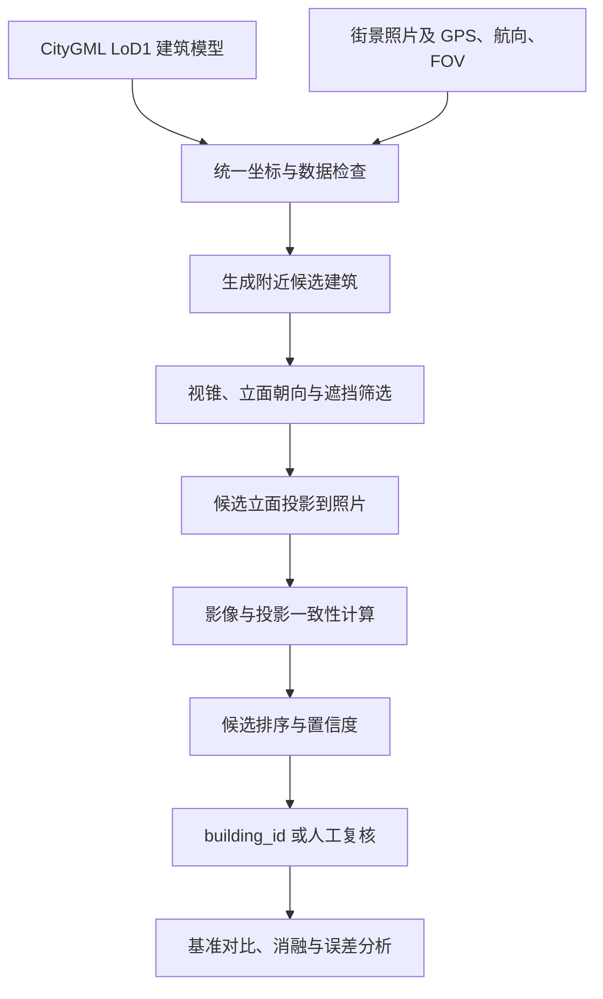

# 基于 CityGML 可见性约束的街景影像—建筑目标检索精度提升研究

本项目研究如何利用 CityGML 中的建筑几何信息，提高街景照片与建筑对象之间的检索准确性。

简单来说，我们希望解决这样一个问题：

> 已知一张街景照片的大致拍摄位置和方向，如何从附近多栋建筑中找出照片真正对应的那一栋？

如果照片关联到了错误建筑，后续从照片中提取的楼层、立面或其他属性也会被写入错误对象。因此，“找对楼”是利用街景影像辅助三维城市模型更新的重要前置环节。

## 项目状态

**启动准备阶段**：正在完成数据核查、Git 协作环境搭建和小规模基准实验设计。

项目周期为一年，团队共 3 人，每位成员每周投入约 1 天。

## 输入与输出

| 类型 | 内容 |
|---|---|
| 输入 | 校园 CityGML LoD1 模型 |
| 输入 | 带有粗略 GPS、航向和视场角的街景照片 |
| 输出 | 每张照片对应的候选建筑列表 |
| 输出 | Top-1 建筑 `building_id` 及分项得分 |
| 输出 | 检索置信度和人工复核标志 |
| 输出 | 实验指标、投影核验图和失败案例 |

## 研究范围

本项目计划完成：

- 建立街景照片—建筑 `building_id` 小规模标注数据集；
- 实现“最近建筑”和“GPS + 方向过滤”基准；
- 使用视锥、立面朝向、距离和遮挡关系筛选候选建筑；
- 将候选建筑立面投影到照片中，计算影像一致性；
- 对候选建筑排序并输出可解释的置信度；
- 通过基准对比、消融和误差扰动实验评价效果。

本项目当前不包含：

- 城市尺度无先验视觉定位；
- 从头训练大型深度学习模型；
- 完整的街景—卫星三维重建系统；
- 以网页平台、NeRF 或 3D Gaussian Splatting 为必做成果。

## 技术路线



项目坚持“先跑通基准，再逐个增加约束”的原则。每加入一个模块，都要单独评价它是否降低错配率，而不是等整个系统完成后才第一次测试。

## 计划使用的技术

| 方向 | 工具或方法 |
|---|---|
| 编程与数据处理 | Python、NumPy、pandas |
| 坐标转换 | pyproj |
| 空间几何 | Shapely、GeoPandas |
| CityGML | XML/GML 解析、LoD1 建筑几何 |
| 相机投影 | OpenCV、针孔相机模型 |
| 图像分割 | 现成预训练模型，必要时使用 PyTorch |
| 实验评价 | scikit-learn、Matplotlib |
| 团队协作 | Git、GitHub 或 GitLab |

具体工具以真实数据和服务器环境为准，不预先引入不必要的依赖。

## 实施阶段

| 阶段 | 时间 | 主要任务 | 阶段成果 |
|---|---|---|---|
| 0. 启动准备 | 2026.09 前两周 | 数据核查、坐标确认、仓库和服务器配置 | 10 张照片端到端检查 |
| 1. 数据与基准 | 2026.09—10 | 标注规范、最近建筑、方向过滤 | Pilot 数据集和基准结果 |
| 2. 几何可见性 | 2026.11—12 | 视锥、立面朝向、距离、遮挡 | 几何约束模块及消融结果 |
| 3. 影像一致性 | 2027.01—03 | 建筑分割、立面投影、排序和置信度 | 完整检索原型 |
| 4. 正式评价 | 2027.04—05 | 基准对比、扰动和失败分析 | 完整实验结果 |
| 5. 成果整理 | 2027.06—08 | 代码整理、报告和演示 | 原型、数据说明和结题报告 |

## 预期成果

- 约 300～500 张照片、50～100 栋建筑的小规模标注数据集；
- 一个可重复运行的 Python 实验原型；
- 街景影像—CityGML 建筑对应关系表；
- 候选建筑和立面投影可视化；
- 基准、消融、误差扰动和失败案例报告；
- 在结果充分的前提下，整理学生论文或软件著作权材料。

## 评价指标

项目主要报告：

- 候选 `Recall@5`；
- `Top-1 Accuracy`；
- 错配率；
- Precision-Coverage；
- 不同 GPS 和航向误差下的稳定性；
- 各个几何与影像模块的消融结果；
- 人工复核比例和典型失败类型。

数据集按照建筑划分调试集和测试集，避免同一建筑的多张照片同时出现在不同集合中。

## 数据说明

原始街景照片、CityGML 数据、模型权重和大规模实验输出不直接提交到普通 Git 仓库。

仓库中仅保存：

- 源代码；
- 配置文件；
- 数据字段和目录说明；
- 不包含敏感信息的数据清单；
- 评价脚本；
- 小型示例和项目文档。

完整数据存放在课题组服务器或经批准的存储空间中。

## 计划中的仓库结构

```text
.
├── README.md
├── PROJECT_GUIDE.md
├── requirements.txt
├── .gitignore
├── configs/
├── src/
├── tests/
├── docs/
│   ├── data_schema.md
│   ├── experiment_log.md
│   └── decisions.md
├── data/
│   └── README.md
└── run_pipeline.py
```

目录会随着实际模块逐步增加，不提前创建无内容的代码框架。

## Git 协作流程

项目成员不直接在 `main` 分支开发。每个任务使用独立分支并通过 Pull Request 合并：

```bash
git switch main
git pull --ff-only
git switch -c feature/任务名称

git status
git diff

git add <修改的文件>
git commit -m "feat: describe the completed task"
git push -u origin feature/任务名称
```

团队约定：

- 一个任务对应一个分支；
- 一个 Pull Request 只解决一件事；
- 合并前至少由另一名成员检查；
- 合并前必须能在其他成员环境中运行；
- 不提交密码、密钥、原始大文件或无法解释的实验结果。

## 项目文档

- [完整项目实施指南](./PROJECT_GUIDE.md)

实施指南包含自主学习路线、月度计划、Git 详细操作、服务器使用方法、负责人要求和风险降级方案。

## 相关资料

- [OGC CityGML 3.0 标准](https://docs.ogc.org/is/20-010/20-010.html)
- [OpenCV 相机标定与三维重建](https://docs.opencv.org/4.x/d9/d0c/group__calib3d.html)
- [Robust Building Identification from Street Views, 2024](https://www.mdpi.com/2075-5309/14/3/578)
- [Visual Localization Using Imperfect 3D Models, CVPR 2023](https://openaccess.thecvf.com/content/CVPR2023/html/Panek_Visual_Localization_Using_Imperfect_3D_Models_From_the_Internet_CVPR_2023_paper.html)

## 团队

本项目由同济大学测绘与地理信息学院三人学生团队完成，并在指导教师指导下开展。
