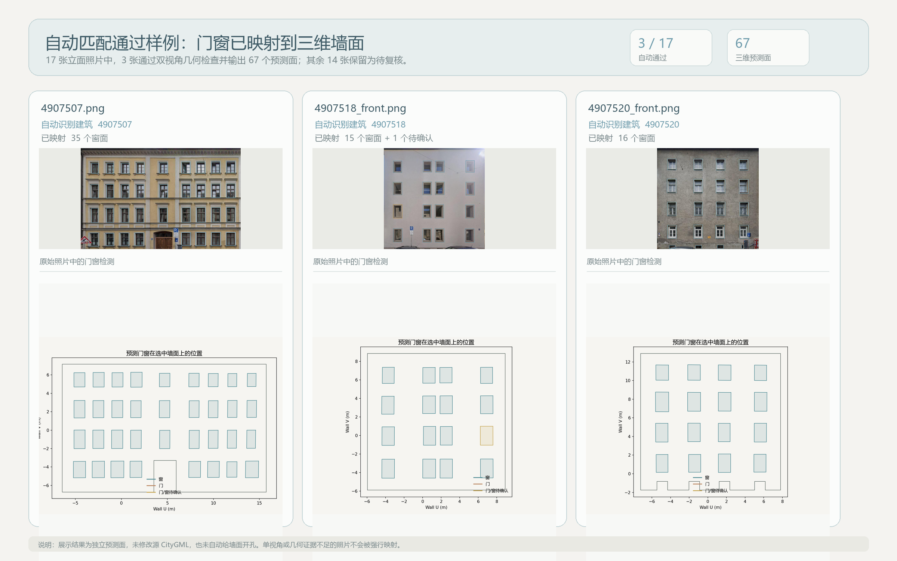
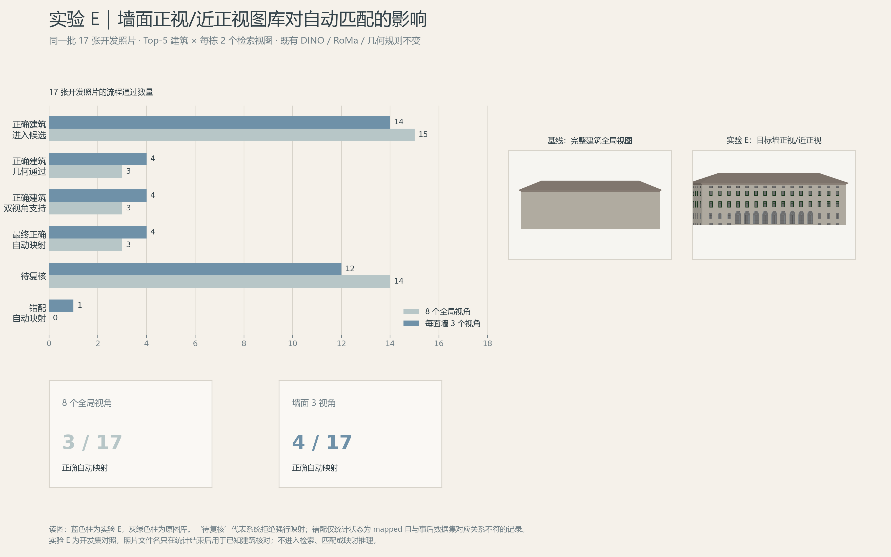
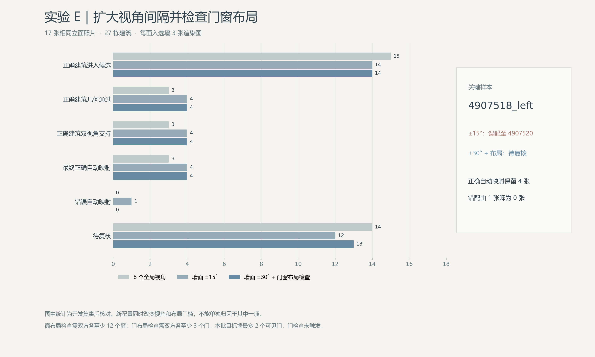
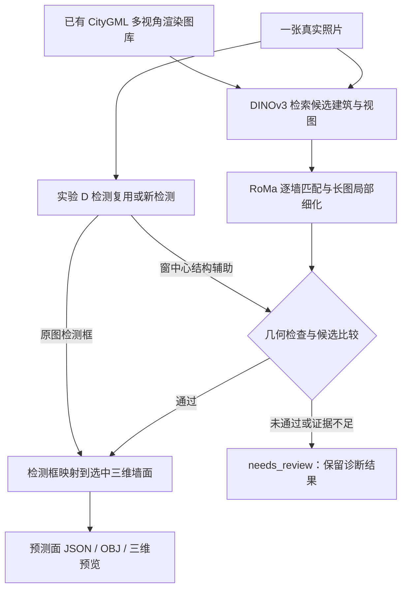
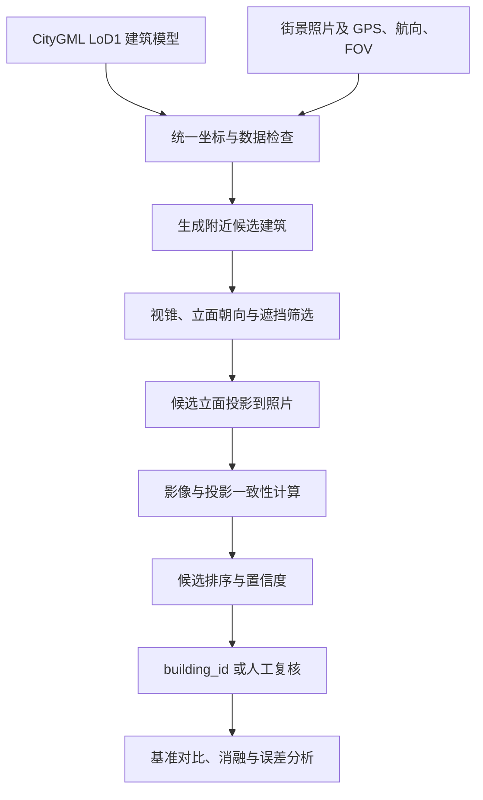

# 基于 CityGML 可见性约束的街景影像—建筑目标检索精度提升研究

本项目研究如何利用 CityGML 中的建筑几何信息，提高街景照片与建筑对象之间的检索准确性。

简单来说，我们希望解决这样一个问题：

> 已知一张街景照片的大致拍摄位置和方向，如何从附近多栋建筑中找出照片真正对应的那一栋？

如果照片关联到了错误建筑，后续从照片中提取的楼层、立面或其他属性也会被写入错误对象。因此，“找对楼”是利用街景影像辅助三维城市模型更新的重要前置环节。

## 项目状态

**2026-10-09 进展**：实验 E 第二轮把墙面三视角改为 **-30° / 0° / +30°**，并增加有足够门窗证据时的布局检查。同一批 17 张开发照片中，正确自动映射保持 **4 张**，错配由第一轮的 **1 张降为 0 张**，其余 13 张待复核。原 8 视角基线和第一轮结果均保留；这不是独立测试集上的准确率。

| 模块 | 当前实际结果 | 结果范围 |
|---|---|---|
| 多建筑渲染图库 | **27/27 栋成功，216 张 1800×1200 图像，0 失败**；每栋 8 视角并保存相机、深度、构件与可见墙面索引 | 作为检索与几何匹配参考；复杂墙面可能需要补充视角 |
| 实验 E 第一轮：墙面视角图库 | **27/27 栋成功，435 张 900×600 图像，0 失败**；每个入选墙面 -15° / 0° / +15° | 正确映射 4/17，错配 1/17，待复核 12/17 |
| 实验 E 第二轮：扩大视角与布局检查 | **27/27 栋成功，435 张 900×600 图像，0 失败**；每个入选墙面 -30° / 0° / +30° | 正确映射 4/17，错配 0/17，待复核 13/17；窗布局门槛拒绝局部重复窗列，门布局仅在双方各至少 3 个有效门时启用 |
| 实验 D 门窗检测 | Grounding DINO 1.6 Pro；**17/17 张成功，397 窗、27 门、2 待确认** | 预测数量，不是准确率；未跨照片去重 |
| 自动找楼与三维预览 | 3 张通过：`4907507` 35 面、`4907518_front` 16 面、`4907520_front` 16 面；14 张待复核，0 异常 | 本批接受的建筑 3/3 与数据集对应关系一致，仍未独立验证米制精度；初轮误接受记录继续保留 |
| 历史三维映射 | `4959323_front` 的 54 个预测框已生成三维预览 | 人工标定历史结果；尚未开孔或导出新的 LoD3 CityGML |

DINOv3 检索中，数据集对应建筑位于 Top-1 的照片为 **10/17**，位于 Top-5 为 **15/17**；检索入选不等于几何匹配通过。本批 **17 张全部复用检测缓存，新增付费请求 0 次**。逐张结果与失败原因见 [17 张实验表](./docs/experiment_log.md#最终复跑17-张开发照片) 和 [汇总 CSV](./docs/results/pipeline_summary.csv)，完整指标见 [审计 JSON](./docs/results/pipeline_summary.json)。

**已通过的单图样例：`4907507.png`。** 程序从图库候选中选中了建筑 `4907507`，生成 **35 个窗的三维预测面**；1 个触及照片底边的检测因目标可能不完整而拒绝投影。下图是独立预测面与已有建筑轮廓的预览，既没有修改模型，也不表示全部 17 张均已通过。可对照 [检索候选图](./docs/images/自动找楼_检索.png) 和 [照片—渲染图对齐检查](./docs/images/自动找楼_对齐.png)。


下图汇总了本轮自动通过的三张照片：上半部分是门窗检测结果，下半部分是投影到对应三维墙面的预测面。其余 14 张因几何证据不足被保守地标记为待复核。



**实验 E 对照结果。** 墙面正视/近正视图库让正确建筑的几何通过、同墙双视角支持和最终正确自动映射均从 3 提升至 4，但候选召回从 15 降至 14，并出现 1 张错配（`4907518_left → 4907520`）。完整定义、逐图审计及 CSV 在 [实验 E 结果](./docs/results/experiment_e/experiment_e_audit.json) 和 [指标表](./docs/results/experiment_e/experiment_e_metrics.csv)。



**实验 E 第二轮。** 把墙面视角改为 ±30°，并要求照片与模型中有足够窗时，窗中心的互相匹配覆盖立面的大部分横向、纵向区域。`4907518_left` 不再被错误映射至 `4907520`，而被送往待复核；4 张正确自动映射保留。门布局检查也已加入代码，但本批 55 个实际几何候选里没有一个同时具备双方各 3 个有效门，因此该规则尚未触发，不能声称门布局提高了精度。第二轮同时改变视角与窗布局门槛，不能从总指标单独判断哪个改动起了作用。[逐图审计](./docs/results/experiment_e2/experiment_e_audit.json)和[指标表](./docs/results/experiment_e2/experiment_e_metrics.csv)记录了全部 17 张。




216 组图片、深度和相机的完整性、源模型身份及几何往返已经核验；2026-10-09 仓库当前代码通过 **104 项测试**。测试验证程序逻辑，不等同于照片匹配正确率。可查看 [图库摘要](./docs/results/gallery_summary.json)、[图库验证](./docs/results/gallery_validation.json)、[实验 D 计数表](./docs/results/detection_D_summary.csv) 和 [历史固定建筑自动匹配摘要](./docs/results/automatic_match_summary.json)。总览从每栋已有视图中选取门窗可见像素最多的一张，原始渲染图保持不变。

**渲染图的门窗来自已有 LoD3 模型，不是检测预测或真实照片贴图。** 模型引用的纹理资源缺失时使用模型颜色与默认材质。8 个基础环绕视角不能保证复杂建筑每面墙的最佳可见性，后续可补墙面正视图。

当前建议运行 [照片自动找楼与三维映射入口](./run_facade_pipeline.py)，修改 `PHOTO_PATH` 即可更换照片。初次操作看 [PyCharm 手把手教程](./docs/pycharm_tutorial.md)，流程与字段速查见 [自动流程说明](./docs/pipeline.md)。其他入口：[批量建立图库](./build_render_gallery.py)、[实验 E 墙面图库](./build_wall_view_gallery.py)、[单栋渲染](./render_building_views.py)、[实验 D 批量检测](./try_grounding_dino16.py)。方法来源、结果限制和历史记录见 [实验记录](./docs/experiment_log.md)。`detect_my_facade.py` 为已弃用的 Tiny 历史入口；`match_facade_roma.py` 的旧主流程用于固定建筑对照，`map_facade_to_3d.py` 保留人工标定和预览用途；统一入口复用其函数，不要求运行人工点选。

统一入口不从照片文件名提取建筑答案，使用图像特征检索后再比较候选几何证据。已有合格检测按图片内容和参数复用；新照片需要云端门窗检测时会使用平台额度。自动检查不通过则输出 `needs_review`，不强行投影；通过时生成独立预测面，仍不修改源 CityGML。检索精度评价、重复窗列错配分析和独立三维精度验证仍需继续。

当前已实现流程中的数据关系如下。检测与检索分别使用同一张照片，预测窗中心可辅助几何细化，检测框在最终通过后用于三维投影。


```mermaid
flowchart TD
    A[一张真实照片] --> B[实验 D 检测复用或新检测]
    A --> C[DINOv3 检索候选建筑与视图]
    L[已有 CityGML 多视角渲染图库] --> C
    C --> D[RoMa 逐墙匹配与长图局部细化]
    D --> E{几何检查与候选比较}
    B -->|窗中心结构辅助| E
    E -->|通过| F[检测框映射到选中三维墙面]
    B -->|原图检测框| F
    E -->|未通过或证据不足| G[needs_review：保留诊断结果]
    F --> H[预测面 JSON / OBJ / 三维预览]
```

收紧后的映射规则要求同一墙至少两个分别推理的视角通过且三维位置一致；只有一个视角时从完整图库补充最多两个可见范围较大的同墙视角，仍无足够证据就返回 `needs_review`。匹配点已先按候选墙筛选，因此 `wall_vote` 表示该墙内的点支持，不是独立确认墙身份的真值证据。

初轮 `4907518_left` 曾误接受建筑 `4907520`，最终已因缺少第二合格视角而拒绝。该记录与两例异常保留在 [初轮审计](./docs/results/pipeline_initial_audit.json) 和 [实验记录](./docs/experiment_log.md)；这些照片参与过规则调试，最终未发生错误接受不能表述为“独立测试准确率 100%”。

下面保留项目原定的建筑检索研究目标与实施计划。当前原型使用含门窗几何的 Texture2LoD3 模型，已实现多建筑候选流程，不代表完成了检索基准评价，也不能直接推断对仅有 LoD1/LoD2 外壳的模型同样有效。

项目周期为一年，团队共 3 人，每位成员每周投入约 1 天。

## 输入与输出

| 类型 | 内容 |
|---|---|
| 输入 | 校园 CityGML LoD1 模型 |
| 输入 | 带有粗略 GPS、航向和视场角的街景照片 |
| 输出 | 每张照片对应的候选建筑列表 |
| 输出 | Top-1 建筑 `building_id` 及分项得分 |
| 输出 | 检索置信度和人工复核标志 |
| 输出 | 实验指标、投影核验图和失败案例 |

## 研究范围

本项目计划完成：

- 建立街景照片—建筑 `building_id` 小规模标注数据集；
- 实现“最近建筑”和“GPS + 方向过滤”基准；
- 使用视锥、立面朝向、距离和遮挡关系筛选候选建筑；
- 将候选建筑立面投影到照片中，计算影像一致性；
- 对候选建筑排序并输出可解释的置信度；
- 通过基准对比、消融和误差扰动实验评价效果。

本项目当前不包含：

- 城市尺度无先验视觉定位；
- 从头训练大型深度学习模型；
- 完整的街景—卫星三维重建系统；
- 以网页平台、NeRF 或 3D Gaussian Splatting 为必做成果。

## 技术路线


```mermaid
flowchart TD
    A[CityGML LoD1 建筑模型] --> C[统一坐标与数据检查]
    B[街景照片及 GPS、航向、FOV] --> C
    C --> D[生成附近候选建筑]
    D --> E[视锥、立面朝向与遮挡筛选]
    E --> F[候选立面投影到照片]
    F --> G[影像与投影一致性计算]
    G --> H[候选排序与置信度]
    H --> I[building_id 或人工复核]
    I --> J[基准对比、消融与误差分析]
```

项目坚持“先跑通基准，再逐个增加约束”的原则。每加入一个模块，都要单独评价它是否降低错配率，而不是等整个系统完成后才第一次测试。

## 计划使用的技术

| 方向 | 工具或方法 |
|---|---|
| 编程与数据处理 | Python、NumPy、pandas |
| 坐标转换 | pyproj |
| 空间几何 | Shapely、GeoPandas |
| CityGML | XML/GML 解析、LoD1 建筑几何 |
| 相机投影 | OpenCV、针孔相机模型 |
| 图像分割 | 现成预训练模型，必要时使用 PyTorch |
| 实验评价 | scikit-learn、Matplotlib |
| 团队协作 | Git、GitHub 或 GitLab |

具体工具以真实数据和服务器环境为准，不预先引入不必要的依赖。

## 实施阶段

| 阶段 | 时间 | 主要任务 | 阶段成果 |
|---|---|---|---|
| 0. 启动准备 | 2026.09 前两周 | 数据核查、坐标确认、仓库和服务器配置 | 10 张照片端到端检查 |
| 1. 数据与基准 | 2026.09—10 | 标注规范、最近建筑、方向过滤 | Pilot 数据集和基准结果 |
| 2. 几何可见性 | 2026.11—12 | 视锥、立面朝向、距离、遮挡 | 几何约束模块及消融结果 |
| 3. 影像一致性 | 2027.01—03 | 建筑分割、立面投影、排序和置信度 | 完整检索原型 |
| 4. 正式评价 | 2027.04—05 | 基准对比、扰动和失败分析 | 完整实验结果 |
| 5. 成果整理 | 2027.06—08 | 代码整理、报告和演示 | 原型、数据说明和结题报告 |

## 预期成果

- 约 300～500 张照片、50～100 栋建筑的小规模标注数据集；
- 一个可重复运行的 Python 实验原型；
- 街景影像—CityGML 建筑对应关系表；
- 候选建筑和立面投影可视化；
- 基准、消融、误差扰动和失败案例报告；
- 在结果充分的前提下，整理学生论文或软件著作权材料。

## 评价指标

项目主要报告：

- 候选 `Recall@5`；
- `Top-1 Accuracy`；
- 错配率；
- Precision-Coverage；
- 不同 GPS 和航向误差下的稳定性；
- 各个几何与影像模块的消融结果；
- 人工复核比例和典型失败类型。

数据集按照建筑划分调试集和测试集，避免同一建筑的多张照片同时出现在不同集合中。

## 数据说明

原始街景照片、CityGML 数据、模型权重和大规模实验输出不直接提交到普通 Git 仓库。

仓库中仅保存：

- 源代码；
- 配置文件；
- 数据字段和目录说明；
- 不包含敏感信息的数据清单；
- 评价脚本；
- 小型示例和项目文档。

完整数据存放在课题组服务器或经批准的存储空间中。

## 计划中的仓库结构

```text
.
├── README.md
├── PROJECT_GUIDE.md
├── requirements.txt
├── .gitignore
├── configs/
├── src/
├── tests/
├── docs/
│   ├── data_schema.md
│   ├── experiment_log.md
│   └── decisions.md
├── data/
│   └── README.md
└── run_pipeline.py
```

目录会随着实际模块逐步增加，不提前创建无内容的代码框架。

## Git 协作流程

项目成员不直接在 `main` 分支开发。每个任务使用独立分支并通过 Pull Request 合并：

```bash
git switch main
git pull --ff-only
git switch -c feature/任务名称

git status
git diff

git add <修改的文件>
git commit -m "feat: describe the completed task"
git push -u origin feature/任务名称
```

团队约定：

- 一个任务对应一个分支；
- 一个 Pull Request 只解决一件事；
- 合并前至少由另一名成员检查；
- 合并前必须能在其他成员环境中运行；
- 不提交密码、密钥、原始大文件或无法解释的实验结果。

## 项目文档

- [PyCharm 手把手操作：单图、批量与结果阅读](./docs/pycharm_tutorial.md)
- [照片自动找楼与三维映射教程](./docs/pipeline.md)
- [当前实验记录与门窗检测、三维映射运行说明](./docs/experiment_log.md)
- [完整项目实施指南](./PROJECT_GUIDE.md)

实施指南包含自主学习路线、月度计划、Git 详细操作、服务器使用方法、负责人要求和风险降级方案。

## 相关资料

- [OGC CityGML 3.0 标准](https://docs.ogc.org/is/20-010/20-010.html)
- [OpenCV 相机标定与三维重建](https://docs.opencv.org/4.x/d9/d0c/group__calib3d.html)
- [Robust Building Identification from Street Views, 2024](https://www.mdpi.com/2075-5309/14/3/578)
- [Visual Localization Using Imperfect 3D Models, CVPR 2023](https://openaccess.thecvf.com/content/CVPR2023/html/Panek_Visual_Localization_Using_Imperfect_3D_Models_From_the_Internet_CVPR_2023_paper.html)

## 团队

本项目由同济大学测绘与地理信息学院三人学生团队完成，并在指导教师指导下开展。
