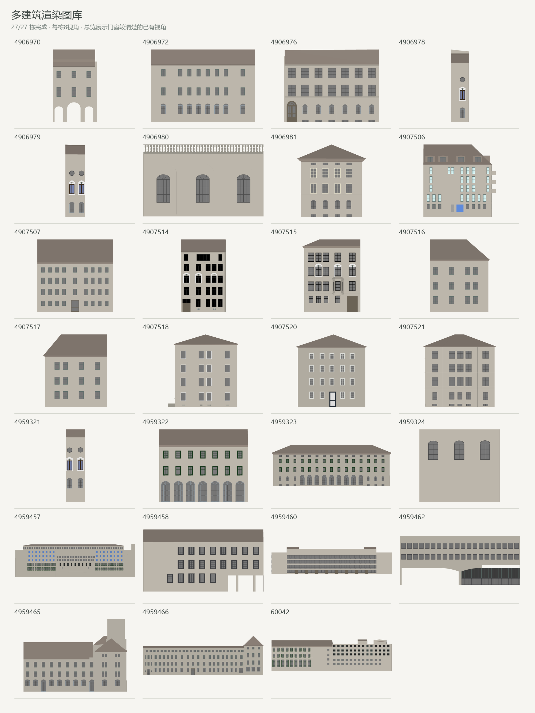
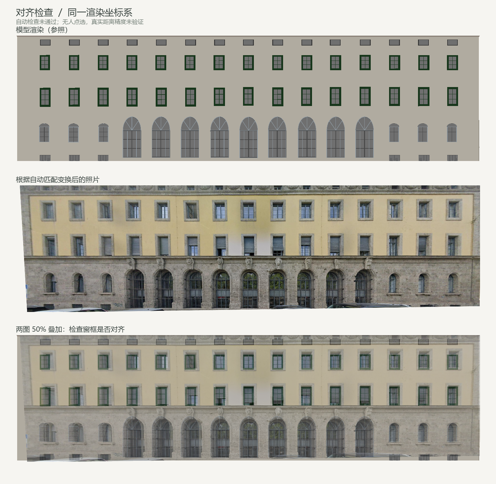
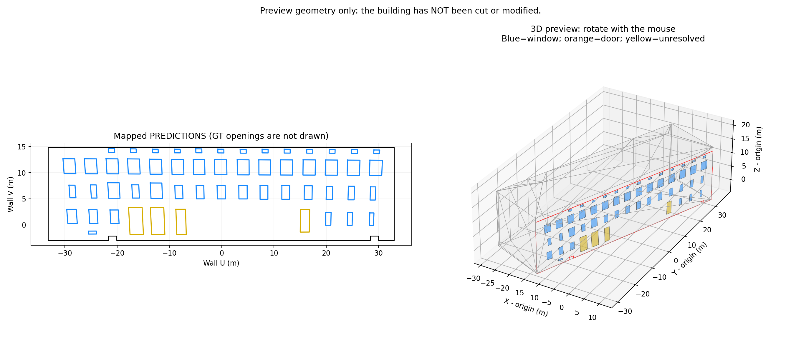

# 多建筑渲染图库、门窗检测与照片匹配：实验记录

更新日期：2026-10-08。除原 27 栋、216 张全局视角图库外，实验 E 已建立 27 栋、435 张墙面正视/近正视图库，并复跑同一批 17 张开发照片：正确自动映射 **3→4**，待复核 **14→12**，同时出现 **0→1** 张错配。下文保留初轮误接受、异常与历史人工结果；本批照片参与了规则调试，不能当作独立测试集。

## 1. 当前进度

| 内容 | 实际结果 | 不能据此推出的结论 |
|---|---|---|
| 多建筑图库 | 27/27 栋成功、0 失败；每栋 8 视角，共 216 张 1800×1200 图片 | 不能推出照片已匹配到正确建筑 |
| 实验 E 墙面图库 | 27/27 栋成功、0 失败；435 张 900×600 图像；每个入选大型竖直平面墙 -15° / 0° / +15° | 完整端到端对照，不是单变量实验，因为渲染分辨率低于基线 |
| 实验 D 门窗检测 | 17/17 张成功；397 个窗、27 个门、2 个待确认 | 预测数不是准确率，也没有跨照片去重 |
| 照片自动找楼与三维预览 | 最终开发集：3 张 `mapped`、14 张待复核、0 异常；67 个预测面，接受建筑 3/3 与数据集对应关系一致 | 只接受 3/17 张；经过同批数据调试，不能报告独立测试准确率或真实定位精度 |
| 历史固定建筑匹配 | 2026-10-05 的 `4959323_front` RoMa 对照试验已保留 | 当时预先给定建筑与视角，自动质量检查未通过 |
| 历史三维预览 | 4959323 正面已有人工标定及 54 个预测四边形 | 不是全批自动标定，也不是完成墙面开孔或 LoD3 写入 |



总览从每栋已有 8 个视图中选取门窗可见像素最多的方向，来源记录在本地批次的 `overview_metadata.json`；原始 216 张图未改变。216 组 PNG/NPZ/相机已逐项验证尺寸、正深度、构件与墙面统计、源模型身份及相机往返。2026-10-06 当前代码在外层与仓库副本各通过 **100 项测试**，本地日志为 `notes/pipeline_final_tests_20261006.log`、`notes/github_pipeline_tests_20261006.log`；程序测试不构成真实照片正确率证明。[图库摘要](./results/gallery_summary.json)、[图库验证记录](./results/gallery_validation.json)、[实验 D 汇总](./results/detection_D_summary.csv) 与 [历史固定建筑匹配摘要](./results/automatic_match_summary.json) 保存了可复查的轻量结果。

**这张图里的门窗是已有 LoD3 模型的几何。** 本次没有把实验 D 预测贴上去，也没有给模型贴入真实照片。当前数据副本缺少 GML 引用的纹理资源，因此渲染使用模型颜色与默认材质。已有模型的门窗不能算成本次从照片重建的成果。

## 2. 代码入口与模型分工

| 文件 | 用途 | 使用什么模型或方法 |
|---|---|---|
| [run_facade_pipeline.py](../run_facade_pipeline.py) | 一张照片的统一运行入口 | 检测复用/新检测、检索、候选比较与三维预览 |
| [facade_retrieval.py](../facade_retrieval.py) | 检索候选建筑和视角 | 本地 DINOv3 ViT-L/16 特征与余弦排序 |
| [facade_auto_mapping.py](../facade_auto_mapping.py) | 自动投影已通过检查的检测框 | 候选墙内点支持、相机射线求交、边界与可见性过滤 |
| [build_render_gallery.py](../build_render_gallery.py) | 批量生成多栋建筑图库 | 调用单栋渲染器；不使用神经网络 |
| [build_wall_view_gallery.py](../build_wall_view_gallery.py) | 实验 E 墙面图库 | 每个合格外立面 3 个正视/近正视图；与基线目录隔离 |
| [evaluate_experiment_e.py](../evaluate_experiment_e.py) | 实验 E 事后审计 | 文件名只在统计阶段提供已知建筑核对，不参与推理 |
| [render_building_views.py](../render_building_views.py) | 解析并渲染一栋 CityGML，保存相机与深度 | 多边形三角化、CPU 深度缓冲、正交相机 |
| [try_grounding_dino16.py](../try_grounding_dino16.py) | 实验 D 批量门窗检测 | Grounding DINO 1.6 Pro 云端 API |
| [facade_geometry.py](../facade_geometry.py) | 坐标还原、去重、门窗冲突与模型关联 | 本地几何规则；不加载检测网络 |
| [match_facade_roma.py](../match_facade_roma.py) | 一张照片与指定建筑渲染图自动匹配 | 官方 RoMa v2.0.1 本地预训练模型 |
| [facade_match_geometry.py](../facade_match_geometry.py) | 几何变换与自动检查 | MAGSAC/RANSAC、空间留出、覆盖及变换合法性检查 |
| [facade_match_structure.py](../facade_match_structure.py) | 照片预测窗中心与模型窗中心的自动细化 | RoMa 初值引导的结构对应及自动验收 |
| [map_facade_to_3d.py](../map_facade_to_3d.py) | 保留的人工标定与三维预览工具 | 照片 XY → 墙面 UV → 模型 XYZ |

`detect_my_facade.py` 是 **已弃用的 Tiny 历史入口**，当前不应再用它执行实验 D。历史文件目前仍保留，不能把“弃用”写成“已删除”。当前自动匹配入口也不会调用人工点选流程。

Grounding DINO 负责检测“哪里有门窗”，DINOv3 检索负责先挑选候选建筑视图，RoMa 负责找“两张图的哪些位置相对应”。检索骨干严格恢复自本地 RoMa v2.0.1 权重的完整 `f.*` 参数，RoMa 内部也使用 DINOv3 特征。三个模型的输入、输出和费用区别见 [统一入口教程](pipeline.md)。

参考项目 [chrise96/3D_building_reconstruction](https://github.com/chrise96/3D_building_reconstruction) 的 Stage 2 使用 Detectron2 Mask R-CNN、R50-FPN 和 sky/window/door 专用权重；目前取得的参考材料没有其 `model_output/model.pth`。本项目改用公开模型或云端模型推进数据适配，没有声称复现原作者的同一套权重与精度。渲染、批次管理、自动几何检查及结构细化属于本项目实现；RoMa 神经网络来自 [官方 RoMaV2](https://github.com/Parskatt/RoMaV2)。

## 3. 批量建立渲染图库

### 输入和运行

数据集模型应位于仓库的 `Drills/Texture2LoD3_dataset/citygml/`，包含实际 GML 内容，不能只是 Git LFS 指针。当前工作目录外层布局也可由批量入口识别。

在 PyCharm 选择现有 Python 3.12 环境，打开 `build_render_gallery.py`，右键运行，或在仓库目录执行：

```bash
python build_render_gallery.py
```

渲染依赖 NumPy、Pillow、mapbox-earcut 和 Shapely；不需要 DDS Token、RoMa 权重或模型推理 GPU。本机现有环境已配置。首次在新机器运行时，先按 [环境与资源准备说明](./setup.md) 准备依赖和完整数据。

默认配置：

```python
BUILDING_IDS = None
IMAGE_SIZE = (1800, 1200)
MAX_WORKERS = 2
REUSE_COMPLETED = True
```

`None` 遍历全部模型；试跑部分建筑可设为 `["4906970", "4959323"]`。默认同时处理两栋，内存紧张可把 `MAX_WORKERS` 改为 1。

程序每栋完成后更新索引和汇总。再次运行会核对源模型哈希、渲染代码哈希、图像尺寸、完成状态以及各视角文件；满足条件才复用。缺相机、深度、图片或总览的结果不会被当成完整缓存。每次会新建图库汇总，不代表每次都重新渲染全部模型。

### 本次结果和目录

实际批次为 `gallery_20261005_212322_924197`，汇总状态 `complete`，27 栋完成、0 失败、216 个视图。

```text
my_results/render_gallery/
├── latest_run.json
├── gallery_时间/
│   ├── overview.png
│   ├── gallery_index.json
│   ├── batch_summary.csv
│   └── batch_summary.json
└── buildings/
    └── 建筑编号/
        ├── latest_run.json
        └── render_时间/
            ├── manifest.json
            ├── overview.png
            ├── view_000.png
            ├── view_000_camera.json
            ├── view_000_geometry.npz
            └── 其他7个视角的配套文件
```

逐栋状态和错误查看 `batch_summary.csv/json`。`latest_run.json` 仅记录最新路径，是否全部成功仍须看汇总。失败时保留已成功建筑，修复后可复用成功输出继续构建新的图库批次。

每栋自动选择有效的大型竖直墙面作为起始参考，以相对 0°、90°、180°、270° 生成四个平视方向，再以 45°、135°、225°、315° 和 22° 相机高度角生成四个斜视方向。`view_000` 不是人工确认的照片正面，也不是固定北面。

这 8 个方向是基础图库，不保证每个复杂墙面都获得最佳正视图。内凹结构、狭窄侧墙和遮挡区域，后续可以继续按墙面补充正视图。

### 3.1 实验 E：墙面正视/近正视图库对照

实验 E 不修改或覆盖原 8 视角图库。它从同一份 CityGML 中筛选出可用于自动映射的单平面、近似竖直且面积足够大的立面；每个入选墙面生成左近正视、正视、右近正视三张图，并保存和基线相同的 PNG、深度、相机和构件索引。模型中被拆成窗台、饰线的小 WallSurface 会按固定面积规则排除，避免产生数千张碎片图。

在相同 17 张照片、相同 `Top-5` 建筑候选和每栋两视图配额下，审计结果如下：

| 指标 | 8 个全局视角 | 每面墙 3 视角 |
|---|---:|---:|
| 正确建筑进入候选 | 15 | 14 |
| 正确建筑几何通过 | 3 | 4 |
| 正确建筑同墙双视角支持 | 3 | 4 |
| 最终正确自动映射 | 3 | 4 |
| 错配自动映射 | 0 | 1 |
| 待复核 | 14 | 12 |

错配是 `4907518_left.png` 被映射到 `4907520`；它在基线中为待复核，因此不能以“自动映射数量增加”掩盖该风险。完整逐图审计在 [experiment_e_audit.json](results/experiment_e/experiment_e_audit.json)，图表在 [实验 E 对照图](images/实验E_墙面视角对照.png)。此次墙面图使用 900×600、基线使用 1800×1200，故结论仅是当前端到端配置下的观察，不是严格的单变量视角消融。

### 为什么不能只保存 PNG

`gallery_index.json` 为每张图保存建筑 ID、视角、图像/相机/几何文件路径、模型指纹、坐标系及 `world_origin_m`。`visible_walls` 按原模型 `wall_id` 聚合可见墙面与关联构件，并记录像素数量。

相机 JSON 保存投影与逆变换；几何 NPZ 保存 `depth_m` 和 `object_index`。深度是可见表面沿相机观察轴的米制距离，不是建筑高度。后续图像匹配得到渲染图上的点后，需要相机、深度和局部原点才能找回三维坐标，故三类文件必须配套保留。

## 4. 实验 D 的批量门窗检测

本次有效完整批次为 `D_20260930_155603_929347`。已核对其 `batch_summary.csv`：17 张成功、0 失败，完整新跑需要 28 个图块任务。下表是去重后的预测数量，不是标注真值或准确率。

| 照片 | 窗 | 门 | 待确认 |
|---|---:|---:|---:|
| 4906970 | 7 | 6 | 0 |
| 4906972_front_01 | 2 | 0 | 1 |
| 4906972_front_02 | 23 | 0 | 0 |
| 4906972_front_03 | 3 | 1 | 0 |
| 4906981 | 58 | 6 | 0 |
| 4907506 | 41 | 2 | 0 |
| 4907507 | 35 | 1 | 0 |
| 4907514 | 21 | 1 | 0 |
| 4907518_front | 15 | 0 | 1 |
| 4907518_left | 19 | 2 | 0 |
| 4907518_right | 17 | 1 | 0 |
| 4907520_front | 20 | 2 | 0 |
| 4907520_right | 21 | 2 | 0 |
| 4959322 | 20 | 1 | 0 |
| 4959323_front | 65 | 0 | 0 |
| 4959323_left | 14 | 1 | 0 |
| 4959323_right | 16 | 1 | 0 |
| **合计** | **397** | **27** | **2** |

主要配置为 `GroundingDino-1.6-Pro`，提示 `window.door.`，框阈值 0.20，分块最大 1200×1000，重叠 300 px，内部切边过滤 12 px，云端 IoU 0.8。跨块重复框由本地几何规则处理，门窗类别冲突保留为 `ambiguous`，不强行当作窗或门。

要重新做检测，在 PyCharm 的该脚本运行配置里设置自己的 `DDS_API_TOKEN`，然后运行：

```bash
python try_grounding_dino16.py
```

Token 不写进代码或 Git。此脚本会上传照片并使用平台额度；图库生成和已有检测结果的匹配不会重新调用它。当前 `RESUME_RUN_DIR=None` 表示新建收费批次，从第一张开始；每张完成后立即保存，网络/API 出错时停止后续提交，已有结果保留。

结果位于 `my_results/grounding_dino16/batch_detection/D_时间/`。先看总表和每图 `detections.png`；`detections.json` 保存原图像素框及模型来源，供匹配与映射读取；`mapping_manifest.json` 只关联已知照片和模型身份，不代表已经完成墙面标定。

ABCD 对照实验及莫兰迪汇总图保留用于回看参数变化。数量增加不能单独证明准确率提高，仍需配准后的误检、漏检和类别评价。51 张全景图和 `gt_masks` 不作为本次门窗检测输入。

## 5. 当前统一流程与历史 RoMa 对照

### 2026-10-06：照片自动检索与三维预览

当前日常入口为 `run_facade_pipeline.py`。在 PyCharm 中修改 `PHOTO_PATH` 并运行即可；建筑编号不从照片名或检测结果里的身份字段读取，也不读取人工标定或 `gt_masks`。详细操作和输出字段见 [pipeline.md](pipeline.md)。

程序先按图片内容哈希和实验 D 设置复用已有检测，再用 DINOv3 从图库取默认 5 栋、每栋 2 个视角，逐一尝试主要可见墙的 RoMa 匹配。长图且粗匹配有一定支持时，新增 1200×1000、重叠 300 像素的局部 RoMa 匹配，仍采用原有 4 px、50% 留出内点比例等验收门槛。分块只用于本地匹配，不额外调用云端检测。

结构细化使用照片预测窗与原模型窗中心，最终候选还需与其他建筑/墙面拉开几何分数差。针对初轮单视角误接受，收紧后的规则要求同墙至少两个分别推理的视角通过且三维回投一致；缺少第二个视角时，从完整图库补充最多两个该墙可见范围较大的视角。补充后证据仍不足或位置不一致就停止投影。跨视角差值仍是两条自动路线之间的差异，不是与独立真值的误差。

候选报告的 `wall_vote` 使用已按候选墙过滤的匹配点，表示墙内点支持，并非独立墙身份真值检查。

候选内分别保存结构细化前的 `roma_matches.*`、局部尝试的 `tiled_matches.*`，以及最终方法对应的 `matches.png` / `geometry_matches.npz`，避免把不同方法的点集与矩阵混用。最终 `mapped` 才生成三维预测面，失败或歧义记为 `needs_review`；源 GML 不修改、不切孔。

### 最终复跑：17 张开发照片

批次为 `batch_20261006_205125_008123`。结果见 [汇总 JSON](results/pipeline_summary.json)、[可用 Excel 打开的 CSV](results/pipeline_summary.csv)。照片建筑编号仅在推理结束后作身份核对，没有传给检索、匹配或选择。DINO 对应建筑 Top-1 为 **10/17**，Top-5 为 **15/17**；最终 3 张接受、14 张待复核，接受的 3 个建筑均与数据集对应关系一致。17 张全部复用实验 D 缓存，新增付费检测请求 **0 次**。

| 照片 | 对应建筑检索名次 | 最终状态 | 预测面 | 原因或结果 |
|---|---:|---|---:|---|
| 4906970.png | 1 | 待复核 | 0 | 无候选通过几何检查 |
| 4906972_front_01.png | 6 | 待复核 | 0 | 对应建筑未进入初选 Top-5；候选几何未通过 |
| 4906972_front_02.png | 5 | 待复核 | 0 | 无候选通过几何检查 |
| 4906972_front_03.png | 7 | 待复核 | 0 | 对应建筑未进入初选 Top-5；候选几何未通过 |
| 4906981.jpg | 2 | 待复核 | 0 | 无候选通过几何检查 |
| 4907506.jpg | 1 | 待复核 | 0 | 无候选通过几何检查 |
| 4907507.png | 5 | 映射预览 | 35 | 建筑 4907507；35 窗，1 个边缘框拒绝 |
| 4907514.png | 1 | 待复核 | 0 | 目标墙非平面，其他候选也未通过 |
| 4907518_front.png | 1 | 映射预览 | 16 | 建筑 4907518；15 窗、1 待确认；背景墙警告保留 |
| 4907518_left.png | 1 | 待复核 | 0 | 缺少同墙第二合格视角，拒绝初轮错误候选 |
| 4907518_right.png | 1 | 待复核 | 0 | 无候选通过几何检查 |
| 4907520_front.png | 1 | 映射预览 | 16 | 建筑 4907520；16 窗，6 个框被投影检查拒绝 |
| 4907520_right.png | 1 | 待复核 | 0 | 无候选通过几何检查 |
| 4959322.jpg | 2 | 待复核 | 0 | 无候选通过几何检查 |
| 4959323_front.jpg | 1 | 待复核 | 0 | 检索正确但候选几何未通过 |
| 4959323_left.png | 2 | 待复核 | 0 | 无候选通过几何检查 |
| 4959323_right.png | 1 | 待复核 | 0 | 无候选通过几何检查 |

`no_candidate_passed_geometry` 表示候选层面的检查没有通过，不等于模型完全没有输出对应点。检查可能涉及点数、留出误差、空间覆盖或目标墙合法性；逐候选原因在 JSON 和本地运行目录中。`4907518_left` 的最终原因为 `insufficient_cross_view_confirmation`。14 张待复核均未强制导出预测面。

67 个预测面为 **66 个窗、1 个门/窗待确认**，是当前检测与映射结果数量，不是新增真值。三组可下载产物如下；各目录还保存同名 MTL 与 `provenance.json`，OBJ 使用局部坐标，世界原点在预测 JSON 中。

| 照片 | 三维预测记录 | OBJ | 预览 |
|---|---|---|---|
| 4907507 | [predictions.json](results/4907507/predictions.json) | [预测面 OBJ](results/4907507/predictions_preview.obj) | [预览图](images/自动找楼_三维.png) |
| 4907518_front | [predictions.json](results/4907518_front/predictions.json) | [预测面 OBJ](results/4907518_front/predictions_preview.obj) | [预览图](results/4907518_front/mapping_preview.png) |
| 4907520_front | [predictions.json](results/4907520_front/predictions.json) | [预测面 OBJ](results/4907520_front/predictions_preview.obj) | [预览图](results/4907520_front/mapping_preview.png) |

本次零错误接受只描述最终接受的这 3 张开发照片，不能推断全体 17 张均正确或独立测试准确率为 100%。双视角一致性未验证真实世界的米制定位误差；门窗类别待确认也没有在映射中自动解决。

### 开发集初轮审计：保留误接受与异常

本地原始记录为 `notes/pipeline_dataset_audit_20261006.json`，发布副本为 [初轮审计](results/pipeline_initial_audit.json)。初轮 17 张全部尝试后，状态为 **3 张 `mapped`、12 张 `needs_review`、2 张运行异常**。3 张产生映射的照片中，按数据集照片—建筑身份对照，2 张建筑正确、1 张错误；它们不是“三张成功”。

| 初轮照片 | 发生了什么 | 如何解释 |
|---|---|---|
| `4907507.png` | 选择 `4907507`，35 个窗投影，1 个底边截断检测拒绝；两个视角均通过 | 已有正确建筑样例，真实定位精度仍未独立验证 |
| `4907520_front.png` | 选择 `4907520` 并投影；只有一个合格视角 | 建筑身份正确，但初轮没有第二视角保证；最终已补充视角重新验收 |
| `4907518_left.png` | **误选择 `4907520`，生成 19 个预测面**；没有第二合格视角 | 错误接受记录保留；这些面不能当有效成果使用 |
| `4907514.png` | `StopIteration`，运行异常 | 目标墙非平面而被合法墙读取器排除，旧代码随后直接取墙导致异常 |
| `4907518_front.png` | 无效墙外环触发 `ValueError`，运行异常 | 非选中参考墙自交使旧预览绘图中断，不是目标墙本身无效 |

其余 12 张为待复核；例如 `4959323_front` 虽然正确建筑在检索首位，几何检查仍未通过，`4959322`、`4907506` 也未强制投影。照片建筑编号只在推理结束后的审计中作身份评价，没有传给检索、匹配和候选选择。

本轮根据这些失败改进双视角支持、补充视角与源墙处理，最终结果见上表。**同一批照片已经用于发现问题和改规则，属于开发集；修正后的复跑不能标为独立测试集成绩。** 旧初轮 `available: false, passed: true` 的行为不会被当作有效双视角确认。

### 本轮修正：区分不合格目标墙与有问题的参考背景

`4907514` 的候选目标墙顶点相对拟合平面的最大偏离约 **0.257 m**，超过既有 **0.03 m** 门槛。它可以被渲染出来，但不能共用一个平面单应矩阵。现在候选预检、跨视角回投和最终映射共用合法目标墙检查，明确拒绝；复跑已返回 `needs_review`，没有放宽门槛，也没有把墙压平后继续映射。

`4907518_front` 的旧异常来自**未选中的背景参考墙自交**。现在合法目标墙仍须严格通过边界检查；对于只用于展示楼体的异常参考墙，保留原始有限三维折线并记录 `preview_context_warnings`，不修补、不填面，也不让背景绘图中断合法目标墙的预测。该照片复跑已生成 16 个预测面（15 窗、1 待确认），并保留这一背景警告。

初轮误接受的 `4907518_left` 补充两个同墙视角后仍未取得合格第二视角，已按 `insufficient_cross_view_confirmation` 拒绝；旧的 19 个错误预测面只作为问题记录，不计入最终 67 个预测面。

### 2026-10-05：固定建筑、固定视角的历史对照

旧单图入口 `match_facade_roma.py` 使用本地 RoMa v2.0.1，流程为：读取指定照片及已有单栋正面渲染 → 裁剪目标立面 → RoMa 初始对应 → RANSAC 与空间留出检查 → 已有预测窗中心/模型窗中心辅助细化 → 自动选择通过门槛的变换。以下为保留的历史对照运行方式；新统一入口复用其中的推理和绘图函数。

在已准备好官方源码、完整权重缓存和单栋配套渲染的环境中运行：

```bash
python match_facade_roma.py
```

本机沿用升级后的 `torch_1`，Python 3.12.14、PyTorch 2.8.0+cu126。RoMa 源码及模型缓存需要单独准备，不随普通 Git 源码提交完整权重；默认入口只读取已缓存资产，缺失时明确报错，不自动重新下载。

默认不读取人工标定文件，不调用 `check_against_manual()`，也不要求用户点对应点。它可以读取实验 D 最新完整批次中的窗检测结果并校验输入身份，不重新执行收费检测。

**这个旧脚本的主流程仍预先选定建筑 4959323 和正面视角。** 新增的多建筑候选选择位于 `run_facade_pipeline.py`，不会把任意 `view_000` 直接当作照片正面。两种入口及其输出目录需要分清。

每次输出到 `my_results/roma_matching/4959323_front/match_时间/`：

- `quality_report.txt`：自动通过/失败及原因。
- `matches.png`：最终选中方法的对应点。
- `roma_matches.png`：纯 RoMa 对照。
- `alignment.png`：最终变换的叠加效果。
- `result.json`：`selected_method`、`automatic_validation`、`auto_accepted` 与状态。
- `run_info.json`、CSV 和 NPZ：输入指纹、参数、原始对应及几何掩码。

`auto_checks_passed` 表示通过自动几何门槛，`auto_checks_failed` 表示未通过；前者仍不是独立真实定位精度证明。规则窗列可能整体错位，不能凭连线多或叠加图看起来接近就报告匹配正确。

2026-10-05 新的真实 GPU 单图试验为 `match_20261005_214050_135840`：纯 RoMa 留出内点比例 42.04%，低于 50% 门槛；结构候选为 69.565%，低于 70%，相对初值的全图最大修正 30.0496 px 也超过 30 px 上限，最终未采用结构候选。最终 `selected_method="roma"`、`auto_checks_failed`、`auto_accepted=false`。本次没有读取人工标定或调用检测 API，结果摘要见 [automatic_match_summary.json](./results/automatic_match_summary.json)。



这张图用于观察偏差，不代表自动验收通过。此前未保留的旧匹配目录不再作为本次结果链接。

另一次旧结构分析与人工参考点比较的最大偏差约 0.435 m，使用不同检测输入和评价方式，不能混作当前自动试验的米制精度。当前自动模式没有独立真值验证，不会通过放宽门槛把失败改写为成功。

## 6. 下一步与当前限制

1. 对多张照片保留成功和失败的完整记录，评价建筑检索候选召回、最终接受率、错配率及需要复核的比例。
2. 分析正确建筑已入选但几何检查失败的原因，继续检查视角覆盖、跨域外观差异、长图细节损失和重复窗列错移。
3. 用独立于拟合、结构细化和参数调试的参考数据，验证实际建筑身份与三维定位精度；跨视角一致性不能替代该项评价。
4. 在几何和类别确认后，另行实现墙体开孔、门窗构件及 CityGML 写入与有效性检查。

检索、候选选择与预测三维预览已实现；全数据集质量评价、独立定位精度验证和实体修改尚未完成。图库及结构辅助基于含门窗的 LoD3；如果最终输入只有 LoD1/LoD2 外壳，必须另外验证缺少门窗几何时的检索和匹配表现。

## 7. 代码、结果与历史文件的保留原则

保留完整数据与权重、实验 D 完整结果、ABCD 对照、有效三维输出、当前渲染图库、正式匹配代码及测试、环境恢复记录。大数据、权重、环境和全套渲染产物不直接提交普通 Git；仓库保存代码、说明、必要的轻量图例与测试。

旧 Tiny 入口和一次性调试文件仍可能出现在本地或仓库中，已按用途标为历史内容。清理操作被执行策略拒绝，实际删除文件数为 0，详见 [清理状态](results/cleanup_status.json)；没有改用其他删除方式绕过拒绝。当前运行入口以第 2 节为准。

## 8. 历史概要：Tiny 检测与人工三维预览

2026-09-29 的 Tiny 批次为 `run_20260929_160455_549558`，17 张照片处理成功，预测 349 个窗、12 个门、29 个待确认。它使用公开 `IDEA-Research/grounding-dino-tiny` 权重，未在当前数据上重新训练。该批次已被实验 D 取代作为日常检测入口，数量比较不能代替准确率对比。

2026-09-30 对 `4959323_front` 进行了历史人工标定：5 对拟合点、1 对额外检查点，拟合 RMSE 0.056262 m，检查点误差 0.169840 m；54 个预测框完成三维映射，其中 50 个窗、4 个待确认。另 6 个框超出当时圈定的照片墙面区域而未映射，不能因此算作二维漏检。



这些数值只描述历史人工参考的一致性，不是整栋建筑的独立重建精度。`map_facade_to_3d.py` 保留该人工交互与预览功能；自动匹配不要求执行该点选流程。图中楼体来自已有模型，独立预测 OBJ 仅包含预测四边形，原始 CityGML 未开孔或写入新门窗。
