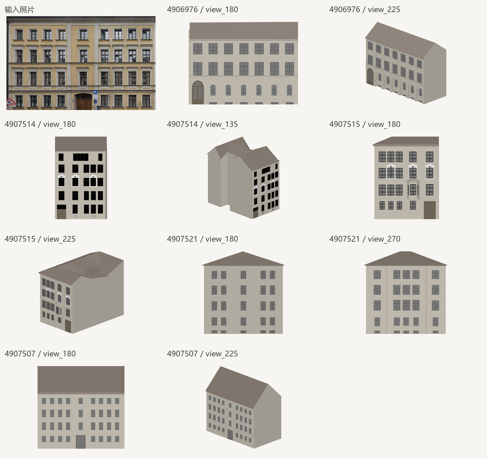
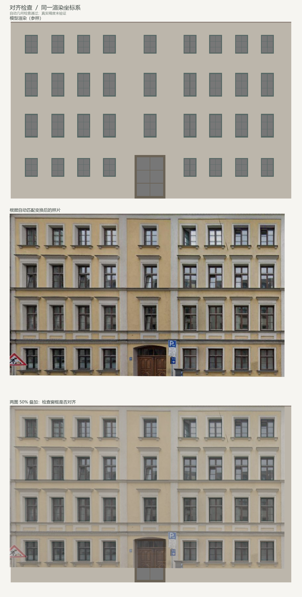
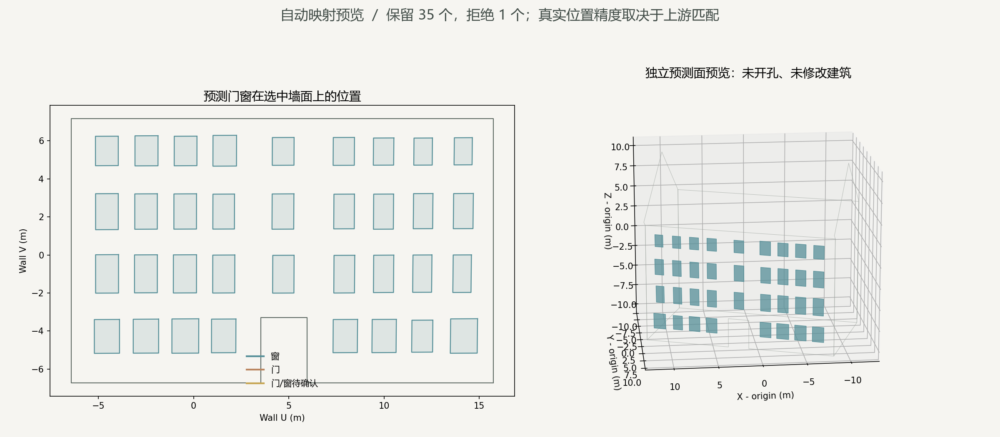

# 照片自动检索建筑与三维门窗映射

统一入口为 [run_facade_pipeline.py](../run_facade_pipeline.py)：一张照片 → 实验 D 门窗检测 → DINOv3 多建筑检索 → RoMa 候选匹配 → 自动几何检查 → 三维预测预览。程序不从照片文件名提取建筑编号，不读取历史人工标定点或 `gt_masks`。

首次使用 PyCharm，可先读 [手把手操作与结果阅读教程](pycharm_tutorial.md)；本页保留流程、输出字段和开发边界速查。

渲染图库与结构细化会使用参考 LoD3 模型原有的门窗几何。输出为独立的预测四边形，不修改源 CityGML，不给墙面开孔，也不代表完成了新 LoD3 建筑重建。

## 运行

环境、依赖与首次模型缓存准备见 [setup.md](setup.md)。先用 `build_render_gallery.py` 生成完整图库，确认 `my_results/render_gallery/latest_run.json` 指向完成状态的 `gallery_index.json`。

在 PyCharm 中打开统一入口，设置：

```python
PHOTO_PATH = DATASET / "textures/4959323_front.jpg"
TOP_BUILDINGS = 5
VIEWS_PER_BUILDING = 2
```

源码默认保留熟悉的 `4959323_front.jpg`，最终复跑检索正确但几何未通过，状态为 `needs_review`。第一次想观察已有成功样例，可主动改为 `PHOTO_PATH = DATASET / "textures/4907507.png"`。这是指定输入照片，并不向推理提供建筑答案。

外部照片可写为 `PHOTO_PATH = Path(r"E:\照片\建筑.jpg")`。选择现有 Python 3.12 解释器，右键运行。照片对应建筑应存在于图库内；当前没有可靠的图库外建筑拒识保证。

终端也可运行：

```powershell
python run_facade_pipeline.py --photo "E:\照片\建筑.jpg" --top-buildings 5 --views-per-building 2
```

检测缓存按图片 SHA256、尺寸、模型、实验 D 参数和原图坐标格式校验。能复用的检测不会重复提交。新照片没有合格缓存时，需要在此脚本的运行配置中设置 `DDS_API_TOKEN`，会上传图块并消耗 DeepDataSpace 额度。程序保存图块任务记录；未知提交状态不会自动重复发起收费任务。

检索和匹配使用本地已下载模型；本入口不会自动下载缺失权重。所有 `my_results`、`model_cache` 路径都以脚本所在项目根目录为基准。若从外层工作目录切换到本仓库副本运行，需准备对应目录中的缓存与结果，不能假定两个副本自动共享。

### 批量模式

仍使用同一入口。在 PyCharm 的“编辑配置 → run_facade_pipeline → 脚本参数 / Parameters”填写：

```text
--photo-dir "E:\workinCODEX\prog_3D\CityGML-IMG_Architecture\Drills\Texture2LoD3_dataset\textures"
```

在仓库根目录终端可使用相对路径：

```powershell
python run_facade_pipeline.py --photo-dir "Drills/Texture2LoD3_dataset/textures"
```

`--photo-dir` 与 `--photo` 不能同时传入；清空参数恢复 `PHOTO_PATH` 单图模式。批量只遍历该目录直接包含的 JPG/JPEG/PNG。请指定真实照片目录，不传 `gt_masks`，也不混入原始全景；程序不能仅凭 PNG 格式区分照片与标注。

### 实验 E：墙面正视/近正视图库

实验 E 不覆盖 `my_results/render_gallery` 的基线图库。每个通过单平面检查、近似竖直且面积足够大的 CityGML 外立面生成三个视角；当前代码默认为 `-30° / 0° / +30°`，第一轮历史结果使用 `-15° / 0° / +15°`。小窗台、饰线等被模型拆分出的碎片墙面不会入选。筛选只读 CityGML 几何，不读照片、检测结果或建筑答案。

在仓库根目录运行（本次实验的实际尺寸为 `900 600`）：

```powershell
python build_wall_view_gallery.py --output-root "E:\workinCODEX\prog_3D\my_results\experiment_e2\wall_view_gallery_30deg" --image-size 900 600 --workers 2
```

完成后打开 `my_results/experiment_e2/wall_view_gallery_30deg/latest_run.json`，把其中 `run_dir` 末尾加上 `gallery_index.json`，作为下面的 `--gallery-index` 值。然后用完全相同的照片、`Top-5` 和每栋两视图配额重跑：

```powershell
python run_facade_pipeline.py --photo-dir "Drills\Texture2LoD3_dataset\textures" --top-buildings 5 --views-per-building 2 --gallery-index "E:\...\wall_gallery_时间\gallery_index.json" --output-root "E:\workinCODEX\prog_3D\my_results\experiment_e2\wall_view_pipeline_30deg_opening_layout"
```

`--output-root` 使检索缓存、逐图诊断和批次汇总都写入独立目录，因而不会覆盖基线；已有实验 D 检测只要内容哈希与参数相同会复用，不会重新请求 API。最后以照片文件名仅作**事后开发集核对**，不能作为推理输入：

```powershell
python evaluate_experiment_e.py --baseline "E:\...\facade_pipeline\batch_...\summary.json" --wall-views "E:\...\wall_view_pipeline_30deg_opening_layout\batch_...\summary.json" --output docs\results\experiment_e2
```

第一轮 ±15° 结果为：17 张照片中正确自动映射 4、错配 1、待复核 12。第二轮 ±30° 加布局检查的结果为：正确自动映射 4、错配 0、待复核 13。两轮墙面图库均为 27 栋、435 张 900×600 图，而基线图库使用 1800×1200；与基线之间不能只归因于视角。第二轮同时改变视角间隔与布局门槛，也不能单独归因于其中一项。[两轮对照](experiment_log.md#32-实验-e-第二轮30-与门窗布局检查)记录了每项指标。

候选结果的 `layout_validation` 记录窗布局检查：照片和该墙各至少 12 个有效窗时，要求至少 12 对互为最近邻窗，且关联窗在照片中的凸包面积、横向与纵向跨度达到固定门槛。`door_layout_validation` 记录门布局检查：双方各至少 3 个有效门时，要求投影门中心有至少 2 对互为最近邻且距离足够近。`required: false` 表示证据不足、该项没有被验证；这些检查只决定自动接受还是待复核，不修改 RoMa 变换，也不证明真实三维位置精度。

每张完成或异常后立即写入 `my_results/facade_pipeline/batch_时间/summary.json`。异常行记录 `status: failed` 和 `error_type`；已经建立单图报告时保留 `run_dir`，尚未建目录时为 `null`，之后继续处理后续照片。`photo_count` 是计划数量，`records` 是已处理记录；批次正常结束不等于每张都成功。没有合格检测缓存的照片仍会使用 API 额度。

## 已通过的单图样例：4907507

本例输入 `4907507.png`，最终从候选中选中建筑 `4907507`，保留 **35 个窗的三维预测面**；1 个触及原照片底边的检测因目标可能不完整而拒绝。这里展示的是已通过的一个样例，不能据此推断全部 17 张都会通过，也不构成独立定位精度证明。

先看检索候选。候选外观相似只是进入后续匹配的理由，最终不会直接采用 DINO 相似度最高者。



再看最终对齐。上、中、下分别是参考渲染、按自动变换对齐的照片、两者叠加；应逐列检查窗格，而不只看局部是否接近。



最后看三维预览。左侧是选中墙面的展开坐标，右侧是已有建筑轮廓和检测预测面；原模型没有开孔或写入这些预测。



## 三个模型的职责

| 模型 | 本项目用途 | 来源 |
|---|---|---|
| Grounding DINO 1.6 Pro | 云端检测窗、门；沿用实验 D 重叠分块、去重和类别冲突保留 | [DeepDataSpace 官方 SDK 示例](https://github.com/deepdataspace/dds-cloudapi-sdk) |
| DINOv3 ViT-L/16 | 为真实照片及渲染图提取全局特征，筛选候选建筑与视角 | [DINOv3](https://github.com/facebookresearch/dinov3) |
| RoMa v2.0.1 | 给照片与候选墙面渲染图建立稠密对应，再用于估计平面变换 | [RoMaV2](https://github.com/Parskatt/RoMaV2) |

DINOv3 从已有 `romav2.0.1.pt` 中的完整 `f.*` 参数恢复，使用 `strict=True` 检查骨干参数；不是随机初始化的检索网络。权重 SHA256 和固定 DINOv3 源码版本写入报告。检索采用最终 CLS 特征的 L2 归一化和余弦相似度。

原参考项目 [3D_building_reconstruction](https://github.com/chrise96/3D_building_reconstruction) 的 Stage 2 是带专用权重的 Mask R-CNN。当前统一入口没有运行那套 Stage 1/2/3 脚本，也没有复现其专用权重：检测改用云端 API，神经网络匹配来自官方 RoMa，检索、缓存、渲染、检查与预测导出为本项目的数据适配实现。自动映射复用本项目旧 `map_facade_to_3d.py` 的墙面几何函数，不执行其人工交互，也不套用原参考 Stage 3 的固定 30 米图高假设。

## 实际处理步骤

1. **准备检测。** 从现有批次或本入口的内容哈希缓存读取合格预测；否则按实验 D 调用云 API。建筑身份字段不用于照片找楼。
2. **检索图库。** 渲染图按深度前景范围裁剪并留少量边距，照片使用全图；分别缩放至 `384×384` 提取特征。按相似度对视图排序，再归并建筑，默认保留 5 栋、每栋 2 个视角。相似度只作候选排序。
3. **逐墙匹配。** 每个初选视角最多取两面足够大的可见墙，分别裁剪匹配；初选最多约 20 个墙面候选，后续可能增加同墙确认视角。不混用两面墙的单应性。RoMa 的归一化点坐标被还原到原照片和完整渲染图坐标。
4. **长图局部匹配。** 长边超过 1400 像素且粗匹配有一定支持时，按最大 1200×1000、重叠 300 像素分块。粗 `H` 只决定渲染图搜索裁剪范围，局部图块再运行 RoMa。还原全图坐标并对重叠源像素去重后，重新执行相同的 4 px 误差、50% 留出内点比例等检查；通过才替代整图对应。没有调用额外检测 API，也没有按粗 `H` 的误差筛出一组必然自洽的点。
5. **几何与结构检查。** 用空间网格分离拟合点与检查点，估计单应矩阵。除点数、留出误差和覆盖范围外，还检查镜像及无效投影。可用实验 D 预测窗中心和模型原有窗中心进行结构细化。`selected_method` 为 `roma` / `roma_tiled`，采用结构细化时再带 `_window_structure`。
6. **比较建筑和墙面。** 只有自动几何检查及候选墙内点支持检查通过的候选能被接受。候选排序采用结构细化前的 RoMa 留出证据，可能来自已通过的局部分块：`holdout_inlier_fraction × min(1, convex_hull_fraction / 0.60)`。最低分数为 `0.35`，与其他建筑/墙面的最低差值为 `0.08`；同墙不同视角归为同一身份。这些是项目筛选规则，不是校准后的正确概率。
7. **双视角核对。** 收紧后的规则要求同一墙至少两个分别推理的视角通过。只有一个时，从完整图库补充最多两个该墙可见范围较大的视角重新匹配；仍没有第二个通过的视角则拒绝投影。对照片内 9×5 个采样点分别回投，比较双方可见位置的三维差：至少 6 点、中位数不超过 0.30 m、P90 不超过 0.75 m；不一致也拒绝投影。
8. **输出三维。** 将原图检测框四角用 `H` 投到渲染图，再沿正交相机射线与选定墙平面求交。检查墙边界、可见性与遮挡后输出预测面；类别冲突继续保留为 `ambiguous`。

自动空间留出检查不使用独立真值。重复窗列可能整体错移却仍然几何自洽，所以通过后仍记录 `independent_accuracy_verified: false`，不能仅据此宣称真实米制精度已验证。一次运行只接受一面平面墙；对于同时包含两面立面的照片，需要进一步分墙处理。

`wall_vote` 的输入已按当前候选墙的构件掩码过滤，它统计的是候选墙内的匹配点支持。该值不能当作独立的墙身份确认，也不能替代建筑候选之间的比较或真实身份核验。

## 输出及阅读顺序

每轮保存到 `my_results/facade_pipeline/run_时间/`，`latest_run.json` 指向最新一轮。先打开 `result.json`，再看图。

| 文件 | 用途 |
|---|---|
| `result.json` | 最终状态、选择理由、建筑和墙面身份、映射报告 |
| `detection_source.json` | 检测文件路径、文件哈希、是否复用 |
| `retrieval.png` / `retrieval.json` | 候选视图拼图、全部排序、检索设置与模型来源 |
| `candidates.csv` / `candidates.json` | 逐候选几何分数、自动检查结果和错误 |
| `candidate_XX/result.json` | 本候选的 `H`、RoMa/结构检查、墙内匹配点支持等 |
| `candidate_XX/roma_matches.png` / `.npz` | 结构细化前采用的 RoMa 对应与掩码，可能已经采用局部分块 |
| `candidate_XX/tiled_matches.png` / `.npz` | 尝试长图局部匹配时保存的对应与检查掩码 |
| `candidate_XX/matches.png` / `alignment.png` | 最终所选方法的对应点和图像对齐检查 |
| `candidate_XX/geometry_matches.npz` | 最终方法的匹配点及拟合/留出掩码，与 `matches.png` 对应 |
| `mapping_3d/mapping_preview.png` | 墙面展开图和三维预测预览 |
| `mapping_3d/predictions.json` | 三维顶点、估计尺寸、保留及拒绝数量与原因 |
| `mapping_3d/predictions_preview.obj` / `.mtl` | 独立预测四边形及材质 |

失败候选可能没有可视化文件；中途失败的整轮也不会有全部最终汇总。文件是否存在须结合状态判断。

| 最终状态 | 含义 |
|---|---|
| `mapped` | 自动选择通过，至少一个预测框通过三维投影检查 |
| `needs_review` | 没有候选通过，或候选身份过于接近；不输出三维预测 |
| `no_detections_mapped` | 选出了候选，但全部框被三维检查拒绝 |
| `failed` | 执行错误，结合 `error_type` 与控制台异常排查 |
| `running` | 尚未完成，或运行被中断 |

`needs_review` 不会弹出人工点选界面，也不会把分数最高的失败候选强行投影。检查 `selection.reason` 与各候选报告，可分清几何检查失败、候选歧义及跨视角位置不一致。

`selection.cross_view_agreement` 中的 `available` 表示是否存在第二个合格视角。收紧后的规则不接受缺少双视角证据的单视图结果。旧初轮报告可能出现 `available: false, passed: true`，那只是旧规则没有触发否决，不能当作双视角确认。`median_m` / `p90_m` 比较两条自动投影路线，不能当作对独立真值的定位误差。

最终结构对应与 RoMa 对应分别保存，不能混用点集与 `H` 计算误差。初始整图的变换和指标记录为 `coarse_roma_homography`、`coarse_roma_validation`，原始匹配缓存路径在 `raw_matches`；局部分块尝试记录在 `tiled_roma`。

OBJ 只包含预测面，不包含整栋楼，使用局部米制坐标；世界坐标为 OBJ 坐标加 `obj_origin_world_m`。检测框贴原照片边界、投到墙外或落到其他可见表面时会被拒绝。二维数量和三维数量可以不同，具体原因在 `predictions.json` 的 `rejected` 中。

目标墙必须满足平面和合法边界检查。例如 `4907514` 目标墙最大离面约 0.257 m，超过 0.03 m 门槛，现在明确返回待复核。能渲染出来不代表能用于单个平面 `H`。

`preview_context_warnings` 只记录未选中背景墙的绘图问题。例如 `4907518_front` 有一面背景参考墙自交，预览改为保留其原始三维折线，合法目标墙的映射继续。目标墙自己无效时仍拒绝，不能用背景容错绕过几何检查；也没有自动修补源模型。

## 调整与复用

正确建筑未进入候选时，先增加 `TOP_BUILDINGS`；建筑已入选但视角不合适时，增加 `VIEWS_PER_BUILDING`。一次只改一项并保留报告比较。几何对齐失败时先看覆盖范围、窗列错移及遮挡，不宜仅降低门槛以获得三维输出。

图库特征缓存绑定图片、深度、模型与预处理；RoMa 原始匹配缓存绑定照片、视图、几何、相机、模型和推理设置。重新运行仍新建报告目录，合格缓存可复用。改检测参数可能使旧预测不能复用，进而触发新收费检测。

模型输入缩放不覆盖原始照片。局部分块提高细节在模型输入中的占比，但 RoMa 内部仍按自身设置缩放；所有检测框、匹配坐标和三维映射使用明确的坐标还原，不能因此声称恢复了未识别的小细节。粗匹配已经错列时，局部匹配仍可能沿用错误搜索区域。

## 代码分工和当前边界

- [run_facade_pipeline.py](../run_facade_pipeline.py)：统一入口、内容哈希检测复用、候选调度与选择。
- [facade_retrieval.py](../facade_retrieval.py)：DINOv3 权重恢复、描述子缓存和建筑检索。
- [facade_auto_mapping.py](../facade_auto_mapping.py)：候选墙内点支持、射线求交、三维预测过滤及导出。
- [facade_match_geometry.py](../facade_match_geometry.py) 与 [facade_match_structure.py](../facade_match_structure.py)：几何检查与窗中心结构细化。
- [match_facade_roma.py](../match_facade_roma.py)、[map_facade_to_3d.py](../map_facade_to_3d.py)：复用模型推理、可视化与墙面几何函数；统一入口不调用旧的固定建筑主流程或人工标定界面。

旧代码清理尚有未完成项，可能仍看到 Tiny 入口或调试存档；当前自动流程以本页统一入口为准。

最终 17 张开发照片复跑已完成：**3 张映射、14 张待复核、0 运行异常，共 67 个预测面**。`4907507` 为 35 个，`4907518_front` 为 16 个，`4907520_front` 为 16 个；接受的 3 个建筑均与数据集对应关系一致。DINO 对应建筑 Top-1 为 10/17、Top-5 为 15/17；17 张全部复用检测缓存，新增付费请求 0 次。根目录与仓库副本各通过 100 项测试。完整 [17 张结果与失败原因](experiment_log.md#最终复跑17-张开发照片)、[CSV](results/pipeline_summary.csv) 和 [JSON](results/pipeline_summary.json) 已保存。

初轮 `4907518_left` 曾误接受建筑 `4907520`，最终因缺少第二合格视角被拒绝；[初轮审计](results/pipeline_initial_audit.json) 没有删除。开发照片已经用于调试规则，复跑不能作为独立测试准确率，双视角一致也不是实际米制精度证明。输出仍是预测面，源 CityGML 没有修改。
